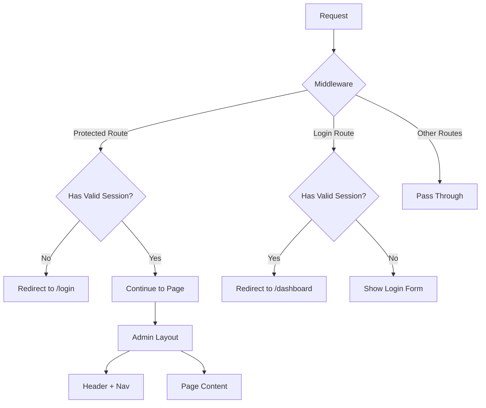

# Design Document: Admin Auth Protection

## Overview

This design implements route protection for the admin panel using Next.js middleware, adds authentication checks to the login page, and consolidates the admin layout to ensure consistent styling. The solution leverages Next.js 16's middleware capabilities and the existing session validation infrastructure.

## Architecture



## Components and Interfaces

### 1. Middleware (`middleware.ts`)

Edge middleware that runs before every request to check authentication status.

```typescript
interface MiddlewareConfig {
  matcher: string[]; // Routes to apply middleware to
}

// Protected routes that require authentication
const PROTECTED_ROUTES = ["/dashboard", "/creators"];

// Public routes that should redirect if authenticated
const AUTH_ROUTES = ["/login"];
```

**Behavior:**

- For protected routes: Check session cookie, redirect to `/login` if invalid
- For auth routes: Check session cookie, redirect to `/dashboard` if valid
- Session validation uses a lightweight check (cookie presence + basic validation)

### 2. Admin Layout (`app/(app)/layout.tsx`)

Shared layout component that wraps all admin pages.

```typescript
interface AdminLayoutProps {
  children: React.ReactNode;
}

interface AdminSession {
  email: string;
  // ... other session fields
}
```

**Components:**

- `AdminHeader`: Site title, user email, logout button
- `AdminNav`: Navigation links with active state highlighting
- `AdminContent`: Main content area for page-specific content

### 3. Logout API Route (`app/api/auth/logout/route.ts`)

Server-side logout handler that destroys the session.

```typescript
// POST /api/auth/logout
// Response: Redirect to /login with cleared cookie
```

## Data Models

No new data models required. Uses existing `AdminSession` from `lib/auth/session.ts`.

## Correctness Properties

_A property is a characteristic or behavior that should hold true across all valid executions of a system—essentially, a formal statement about what the system should do. Properties serve as the bridge between human-readable specifications and machine-verifiable correctness guarantees._

### Property 1: Protected Route Access Control

_For any_ request to a protected route (`/dashboard`, `/creators`) without a valid session cookie, the middleware shall redirect to `/login`.

**Validates: Requirements 1.1, 1.2**

### Property 2: Authenticated Access Allowed

_For any_ request to a protected route with a valid session cookie, the middleware shall allow the request to proceed without redirect.

**Validates: Requirements 1.3**

### Property 3: Login Page Redirect for Authenticated Users

_For any_ request to `/login` with a valid session cookie, the page shall redirect to `/dashboard`.

**Validates: Requirements 2.1**

### Property 4: Logout Session Destruction

_For any_ valid session, after invoking the logout action, the session cookie shall be cleared and the session shall no longer be valid in the database.

**Validates: Requirements 4.1, 4.2, 4.3**

## Error Handling

| Scenario                                       | Handling                                            |
| ---------------------------------------------- | --------------------------------------------------- |
| Invalid session cookie                         | Redirect to login, clear invalid cookie             |
| Database connection error during session check | Allow request (fail open for middleware), log error |
| Missing session cookie                         | Redirect to login for protected routes              |

## Testing Strategy

### Unit Tests

- Test `isProtectedRoute()` helper function
- Test `isAuthRoute()` helper function
- Test session cookie parsing logic

### Property-Based Tests

- **Property 1 & 2**: Generate random route paths and session states, verify correct redirect behavior
- **Property 3**: Generate valid sessions, verify login page redirects
- **Property 4**: Generate sessions, invoke logout, verify session invalidation

### Integration Tests

- Full request flow through middleware
- Login → Dashboard → Logout → Login flow

**Testing Framework:** Vitest with `@testing-library/react` for component tests
