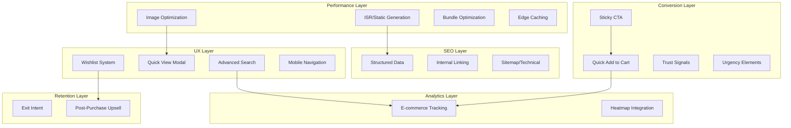

# Design Document: Comprehensive Site Optimization

## Overview

This design document outlines the technical architecture and implementation approach for optimizing DigiInsta's performance, SEO, conversion rates, and user experience. The implementation leverages Next.js 16's latest features including ISR, React Server Components, and the App Router to achieve sub-2.5-second LCP and significantly improved conversion metrics.

The optimization strategy is organized into six interconnected modules:

1. **Performance Module** - Static generation, image optimization, bundle reduction
2. **SEO Module** - Structured data, internal linking, technical SEO
3. **Conversion Module** - Quick-add, sticky CTA, trust signals, urgency elements
4. **UX Module** - Advanced search, quick view, wishlist, mobile navigation
5. **Analytics Module** - Enhanced e-commerce tracking, heatmaps
6. **Retention Module** - Exit intent, post-purchase upsells

## Architecture



## Components and Interfaces

### 1. Performance Components

#### 1.1 Static Generation Configuration

```typescript
// lib/static-generation.ts
interface StaticGenerationConfig {
  products: {
    revalidate: 3600; // 1 hour
    dynamicParams: true;
  };
  categories: {
    revalidate: 86400; // 24 hours
    dynamicParams: true;
  };
  bundles: {
    revalidate: 3600; // 1 hour
    dynamicParams: true;
  };
}

// generateStaticParams for product pages
async function generateProductParams(): Promise<{ slug: string }[]>;

// On-demand revalidation webhook handler
async function handleRevalidation(
  collection: "products" | "categories" | "bundles",
  slug: string
): Promise<void>;
```

#### 1.2 Image Optimization Component

```typescript
// components/storefront/shared/OptimizedImage.tsx
interface OptimizedImageProps {
  src: string;
  alt: string;
  priority?: boolean; // For above-fold images
  sizes?: string; // Responsive sizes
  aspectRatio?: "4/3" | "1/1" | "16/9";
  blurDataURL?: string; // Base64 blur placeholder
  className?: string;
}

// Generates blur placeholder at build time
function generateBlurDataURL(imageUrl: string): Promise<string>;
```

#### 1.3 Bundle Analyzer Configuration

```typescript
// next.config.ts additions
interface BundleOptimizationConfig {
  dynamicImports: string[]; // Components to lazy load
  treeShaking: {
    icons: boolean; // Only import used icons
    lodash: boolean; // Import specific functions
  };
  splitChunks: {
    maxSize: 200000; // 200KB max chunk size
  };
}
```

### 2. SEO Components

#### 2.1 Enhanced Structured Data

```typescript
// lib/seo/structured-data.ts
interface ProductSchemaEnhanced {
  "@type": "Product";
  name: string;
  description: string;
  image: string[];
  brand: BrandSchema;
  offers: OfferSchema;
  aggregateRating?: AggregateRatingSchema;
  review?: ReviewSchema[];
}

interface OfferSchema {
  "@type": "Offer";
  price: string;
  priceCurrency: "USD";
  availability: string;
  priceValidUntil?: string; // For sale items
  seller: OrganizationSchema;
}

interface AggregateRatingSchema {
  "@type": "AggregateRating";
  ratingValue: number;
  reviewCount: number;
  bestRating: number;
  worstRating: number;
}

interface ArticleSchema {
  "@type": "Article" | "BlogPosting";
  headline: string;
  author: PersonSchema;
  datePublished: string;
  dateModified: string;
  image: string;
  wordCount: number;
  timeRequired: string; // ISO 8601 duration
}

// Schema generators
function getEnhancedProductSchema(product: Product): ProductSchemaEnhanced;
function getArticleSchema(post: BlogPost): ArticleSchema;
function getProductGroupSchema(bundle: Bundle): ProductGroupSchema;
function getSoftwareApplicationSchema(product: Product): SoftwareApplicationSchema;
```

#### 2.2 Internal Linking Components

```typescript
// components/storefront/product/RelatedProducts.tsx
interface RelatedProductsProps {
  productId: number;
  subcategoryId: number;
  limit?: number;
  title?: string;
}

// components/storefront/product/FrequentlyBoughtTogether.tsx
interface FrequentlyBoughtTogetherProps {
  productId: number;
  limit?: number;
}

// components/storefront/shared/RelatedCategories.tsx
interface RelatedCategoriesProps {
  currentCategoryId: number;
  limit?: number;
}

// lib/storefront/recommendations.ts
async function getFrequentlyBoughtTogether(productId: number): Promise<Product[]>;
async function getCustomersAlsoViewed(productId: number, categoryId: number): Promise<Product[]>;
async function getRelatedCategories(categoryId: number): Promise<Category[]>;
```

### 3. Conversion Components

#### 3.1 Quick Add to Cart

```typescript
// components/storefront/product/QuickAddButton.tsx
interface QuickAddButtonProps {
  product: {
    id: number;
    title: string;
    price: number;
    compareAtPrice?: number;
    polarProductId: string;
    images: ProductImage[];
  };
  variant?: "overlay" | "inline";
  onSuccess?: () => void;
}

// Optimistic update hook
function useOptimisticCart(): {
  addItem: (item: CartItem) => void;
  isPending: boolean;
};
```

#### 3.2 Sticky Add to Cart Bar

```typescript
// components/storefront/product/StickyAddToCart.tsx
interface StickyAddToCartProps {
  product: {
    id: number;
    title: string;
    price: number;
    compareAtPrice?: number;
    polarProductId: string;
    images: ProductImage[];
  };
  triggerRef: RefObject<HTMLElement>; // Element to observe for visibility
}

// Hook to detect when element leaves viewport
function useElementVisibility(ref: RefObject<HTMLElement>): boolean;
```

#### 3.3 Trust Signals Component

```typescript
// components/storefront/shared/TrustSignals.tsx
interface TrustSignalsProps {
  variant: "product" | "checkout" | "footer";
  showSalesCount?: boolean;
  productId?: number;
}

interface TrustBadge {
  icon: string;
  title: string;
  description: string;
}

// components/storefront/shared/RecentPurchases.tsx
interface RecentPurchasesProps {
  enabled: boolean;
  interval?: number; // ms between notifications
}
```

#### 3.4 Urgency Elements

```typescript
// components/storefront/product/SaleCountdown.tsx
interface SaleCountdownProps {
  endDate: Date;
  variant?: "badge" | "banner" | "inline";
}

// components/storefront/product/ProductBadges.tsx
interface ProductBadgesProps {
  product: {
    createdAt: string;
    compareAtPrice?: number;
    price: number;
    salesCount?: number;
  };
}

type BadgeType = "new" | "sale" | "popular" | "limited";
```

#### 3.5 One-Click Checkout

```typescript
// components/storefront/product/BuyNowButton.tsx
interface BuyNowButtonProps {
  product: {
    polarProductId: string;
    title: string;
    price: number;
  };
  className?: string;
}

// lib/checkout/express.ts
interface ExpressCheckoutConfig {
  skipCart: boolean;
  prefillEmail?: string;
  successUrl: string;
  cancelUrl: string;
}

async function initiateExpressCheckout(
  productId: string,
  config: ExpressCheckoutConfig
): Promise<{ checkoutUrl: string }>;
```

### 4. UX Components

#### 4.1 Advanced Search

```typescript
// components/storefront/search/AdvancedSearch.tsx
interface AdvancedSearchProps {
  placeholder?: string;
  showFilters?: boolean;
  showSuggestions?: boolean;
}

interface SearchFilters {
  category?: string;
  priceRange?: { min: number; max: number };
  tags?: string[];
  sortBy?: "newest" | "price-asc" | "price-desc" | "best-selling";
}

interface SearchSuggestion {
  type: "product" | "category" | "query";
  title: string;
  slug?: string;
  image?: string;
}

// lib/storefront/search-enhanced.ts
async function searchWithFilters(query: string, filters: SearchFilters): Promise<SearchResult>;

async function getSearchSuggestions(query: string): Promise<SearchSuggestion[]>;
async function trackSearchQuery(query: string, resultsCount: number): Promise<void>;
```

#### 4.2 Quick View Modal

```typescript
// components/storefront/product/QuickViewModal.tsx
interface QuickViewModalProps {
  productSlug: string;
  isOpen: boolean;
  onClose: () => void;
}

interface QuickViewData {
  id: number;
  title: string;
  slug: string;
  shortDescription: string;
  price: number;
  compareAtPrice?: number;
  images: ProductImage[];
  polarProductId: string;
}

// Hook for lazy loading product data
function useQuickViewData(slug: string): {
  data: QuickViewData | null;
  isLoading: boolean;
  error: Error | null;
};
```

#### 4.3 Wishlist System

```typescript
// lib/wishlist/wishlist-context.tsx
interface WishlistItem {
  id: string;
  productId?: number;
  bundleId?: number;
  type: "product" | "bundle";
  title: string;
  price: number;
  image: string;
  slug: string;
  addedAt: string;
}

interface WishlistContextType {
  items: WishlistItem[];
  itemCount: number;
  addItem: (item: Omit<WishlistItem, "id" | "addedAt">) => void;
  removeItem: (id: string) => void;
  isInWishlist: (id: number, type: "product" | "bundle") => boolean;
  moveToCart: (id: string) => void;
  clearWishlist: () => void;
}

// components/storefront/wishlist/WishlistButton.tsx
interface WishlistButtonProps {
  item: {
    id: number;
    type: "product" | "bundle";
    title: string;
    price: number;
    image: string;
    slug: string;
  };
  variant?: "icon" | "button";
}
```

#### 4.4 Mobile Navigation

```typescript
// components/storefront/layout/MobileBottomNav.tsx
interface MobileBottomNavProps {
  items: NavItem[];
}

interface NavItem {
  icon: React.ComponentType;
  label: string;
  href?: string;
  action?: "search" | "cart" | "menu";
  badge?: number;
}

// components/storefront/layout/MobileMegaMenu.tsx
interface MobileMegaMenuProps {
  categories: Category[];
  isOpen: boolean;
  onClose: () => void;
}

// Hook for swipe gestures
function useSwipeGesture(
  ref: RefObject<HTMLElement>,
  options: { onSwipeLeft?: () => void; onSwipeRight?: () => void }
): void;
```

### 5. Analytics Components

#### 5.1 Enhanced E-commerce Tracking

```typescript
// lib/analytics/ecommerce.ts
interface ProductImpression {
  id: string;
  name: string;
  category: string;
  price: number;
  position: number;
  list: string;
}

interface CheckoutStep {
  step: number;
  option?: string;
  products: ProductImpression[];
  value: number;
}

// Track product impressions on listing pages
function trackProductImpressions(products: ProductImpression[], listName: string): void;

// Track product click from listing
function trackProductClick(product: ProductImpression, listName: string): void;

// Track checkout funnel
function trackCheckoutStep(step: CheckoutStep): void;

// Track purchase completion
function trackPurchase(order: { id: string; revenue: number; products: ProductImpression[] }): void;
```

#### 5.2 Heatmap Integration

```typescript
// lib/analytics/heatmap.ts
interface HeatmapConfig {
  provider: "clarity" | "hotjar";
  projectId: string;
  respectDNT: boolean;
}

// components/analytics/HeatmapProvider.tsx
interface HeatmapProviderProps {
  config: HeatmapConfig;
  children: React.ReactNode;
}

// Track scroll depth
function trackScrollDepth(percentage: number, pageType: string): void;

// Track rage clicks
function trackRageClick(element: string, count: number): void;
```

### 6. Retention Components

#### 6.1 Exit Intent Popup

```typescript
// components/storefront/shared/ExitIntentPopup.tsx
interface ExitIntentPopupProps {
  offer: {
    title: string;
    description: string;
    discountCode?: string;
    discountPercent?: number;
  };
  onSubscribe: (email: string) => Promise<void>;
}

// Hook to detect exit intent
function useExitIntent(options: {
  threshold?: number; // Distance from top to trigger
  delay?: number; // Delay before showing
  cookieDays?: number; // Days to remember dismissal
}): {
  showPopup: boolean;
  dismiss: () => void;
};
```

#### 6.2 Post-Purchase Upsell

```typescript
// components/storefront/checkout/PostPurchaseUpsell.tsx
interface PostPurchaseUpsellProps {
  purchasedProducts: number[];
  orderId: string;
}

// lib/storefront/upsell.ts
interface UpsellRecommendation {
  product: Product;
  reason: "complementary" | "bundle" | "popular";
  discount?: number;
}

async function getUpsellRecommendations(
  purchasedProductIds: number[]
): Promise<UpsellRecommendation[]>;

async function trackUpsellConversion(orderId: string, productId: number): Promise<void>;
```

## Data Models

### Cache Configuration

```typescript
// lib/cache/config.ts
interface CacheConfig {
  static: {
    maxAge: 31536000; // 1 year for immutable assets
    staleWhileRevalidate: 86400;
  };
  dynamic: {
    maxAge: 3600; // 1 hour for product data
    staleWhileRevalidate: 300;
  };
  api: {
    maxAge: 60; // 1 minute for API responses
    staleWhileRevalidate: 30;
  };
}
```

### Wishlist Storage Schema

```typescript
// localStorage schema
interface WishlistStorage {
  version: 1;
  items: WishlistItem[];
  createdAt: string;
  updatedAt: string;
}
```

### Search Analytics Schema

```typescript
// Search query tracking
interface SearchQueryLog {
  query: string;
  resultsCount: number;
  timestamp: string;
  filters?: SearchFilters;
  clickedResult?: {
    type: "product" | "category" | "bundle";
    id: number;
    position: number;
  };
}
```

## Correctness Properties

_A property is a characteristic or behavior that should hold true across all valid executions of a system—essentially, a formal statement about what the system should do. Properties serve as the bridge between human-readable specifications and machine-verifiable correctness guarantees._

Based on the prework analysis, the following correctness properties have been identified. Properties are consolidated to eliminate redundancy while ensuring comprehensive coverage.

### Performance Properties

**Property 1: Static params generation returns valid slugs**
_For any_ call to `generateStaticParams` for products, categories, or bundles, the returned array SHALL contain only slugs that exist in the database and are in active status.
**Validates: Requirements 1.1, 1.2, 1.3**

**Property 2: Blur data URL generation produces valid base64**
_For any_ valid image URL, the `generateBlurDataURL` function SHALL return a valid base64-encoded string that can be used as a data URL.
**Validates: Requirements 2.4**

### SEO Properties

**Property 3: Product schema includes valid review data when available**
_For any_ product with reviews, the generated schema SHALL include a valid `AggregateRating` with `ratingValue` between 1-5, `reviewCount` >= 1, and individual `Review` objects with required fields (author, reviewBody, reviewRating).
**Validates: Requirements 6.1, 6.2**

**Property 4: Sale items include priceValidUntil in Offer schema**
_For any_ product where `compareAtPrice > price` AND `saleEndDate` is set, the generated `Offer` schema SHALL include `priceValidUntil` formatted as ISO 8601 date.
**Validates: Requirements 6.3**

**Property 5: Bundle schema includes all product references**
_For any_ bundle with N products, the generated `ProductGroup` schema SHALL include exactly N `isRelatedTo` product references with valid URLs.
**Validates: Requirements 6.4**

**Property 6: Blog post schema contains required article fields**
_For any_ published blog post, the generated schema SHALL include `headline`, `author` (with name), `datePublished`, `dateModified`, `wordCount` > 0, and `timeRequired` in ISO 8601 duration format.
**Validates: Requirements 8.1, 8.2**

**Property 7: Reading time calculation is consistent**
_For any_ text content, the calculated reading time SHALL equal `ceil(wordCount / 200)` minutes, where wordCount is the number of words in the content.
**Validates: Requirements 8.3**

**Property 8: Table of contents extraction is complete**
_For any_ content with H2/H3 headings, the generated table of contents SHALL contain all headings in document order with correct hierarchy.
**Validates: Requirements 8.4**

**Property 9: Breadcrumb generation produces valid hierarchy**
_For any_ product page, the breadcrumb schema SHALL contain exactly 4 items in order: Home → Category → Subcategory → Product, each with valid `name` and `item` URL.
**Validates: Requirements 7.3**

**Property 10: Sitemap entries include required attributes**
_For any_ page in the sitemap, the entry SHALL include `url`, `lastmod` (valid ISO date), `changefreq` (valid value), and `priority` (0.0-1.0).
**Validates: Requirements 9.1**

**Property 11: Canonical URLs are correctly formed**
_For any_ page, the canonical URL SHALL be the absolute URL without query parameters or fragments, matching the pattern `{SITE_URL}/{path}`.
**Validates: Requirements 9.4**

### Conversion Properties

**Property 12: Cart operations preserve data integrity**
_For any_ product added to cart, the cart state SHALL contain an item with matching `productId`, `title`, `price`, and `type`, and the `itemCount` SHALL equal the number of unique items.
**Validates: Requirements 10.2, 10.5**

**Property 13: Sale countdown calculates correctly**
_For any_ sale with `endDate` in the future, the countdown SHALL display correct days, hours, minutes, seconds until `endDate`, and SHALL show "Ended" when `endDate` is in the past.
**Validates: Requirements 13.1**

**Property 14: Product badges are correctly determined**
_For any_ product, badges SHALL be assigned as follows:

- "New" badge: `createdAt` within last 14 days
- "Sale" badge: `compareAtPrice > price`
- "Popular" badge: `salesCount >= popularThreshold`
  **Validates: Requirements 13.2, 13.3, 13.4**

**Property 15: Customer preferences persist correctly**
_For any_ preference saved to localStorage, retrieving the preference SHALL return the same value, and preferences SHALL survive page reload.
**Validates: Requirements 14.3**

### UX Properties

**Property 16: Search with filters returns correctly filtered results**
_For any_ search query with filters, ALL returned results SHALL:

- Match the search query in title, description, or tags
- Fall within the specified price range (if set)
- Belong to the specified category (if set)
- Be sorted according to the specified sort order
  **Validates: Requirements 15.1, 15.2, 15.3**

**Property 17: Search suggestions are relevant**
_For any_ search query of 2+ characters, returned suggestions SHALL contain the query string (case-insensitive) in the title or be a previously successful search query.
**Validates: Requirements 15.1**

**Property 18: Wishlist round-trip preserves data**
_For any_ item added to wishlist, the item SHALL be retrievable with identical `productId`/`bundleId`, `title`, `price`, `image`, and `slug`. The `itemCount` SHALL equal the number of unique items.
**Validates: Requirements 17.1, 17.2, 17.3**

**Property 19: Wishlist to cart transfer is complete**
_For any_ item moved from wishlist to cart, the item SHALL be removed from wishlist AND added to cart with identical product data.
**Validates: Requirements 17.5**

### Analytics Properties

**Property 20: Analytics events contain required data fields**
_For any_ tracked event, the event payload SHALL contain:

- Product impressions: `id`, `name`, `category`, `price`, `position`, `list`
- Add to cart: `item_id`, `item_title`, `price`, `item_type`
- Checkout: `item_count`, `total`, `currency`
- Purchase: `order_id`, `revenue`, `products` array
  **Validates: Requirements 19.1, 19.2, 19.3, 19.4, 19.5**

**Property 21: Search queries are tracked with results count**
_For any_ search performed, an analytics event SHALL be fired with `query` string and `results_count` integer.
**Validates: Requirements 15.6**

### Recommendation Properties

**Property 22: Related products exclude the source product**
_For any_ product, the "Frequently Bought Together" and "Customers Also Viewed" recommendations SHALL NOT include the source product itself.
**Validates: Requirements 7.1, 7.2**

**Property 23: Related products are from same or related categories**
_For any_ product in category C, at least 80% of "Customers Also Viewed" recommendations SHALL be from category C or its sibling categories.
**Validates: Requirements 7.2**

**Property 24: Post-purchase recommendations are complementary**
_For any_ completed purchase, upsell recommendations SHALL NOT include products already purchased in the order.
**Validates: Requirements 22.1, 22.3**

**Property 25: Upsell conversion tracking is accurate**
_For any_ upsell purchase, the tracking event SHALL include the original `orderId` and the upsold `productId`.
**Validates: Requirements 22.4**

## Error Handling

### Performance Errors

| Error Scenario                     | Handling Strategy                                    | User Impact                    |
| ---------------------------------- | ---------------------------------------------------- | ------------------------------ |
| Static generation fails for a page | Fall back to SSR with `dynamicParams: true`          | Slightly slower initial load   |
| Image optimization fails           | Serve original image with warning log                | Larger image size              |
| Revalidation webhook fails         | Retry with exponential backoff, alert on 3rd failure | Stale content for up to 1 hour |
| Bundle size exceeds limit          | Build warning, CI/CD gate                            | None (prevented at build)      |

### SEO Errors

| Error Scenario           | Handling Strategy           | User Impact                |
| ------------------------ | --------------------------- | -------------------------- |
| Schema generation fails  | Omit schema, log error      | Reduced rich snippets      |
| Sitemap generation fails | Serve cached sitemap, alert | Potentially stale sitemap  |
| Canonical URL malformed  | Fall back to current URL    | Possible duplicate content |

### Conversion Errors

| Error Scenario           | Handling Strategy              | User Impact                |
| ------------------------ | ------------------------------ | -------------------------- |
| Add to cart fails        | Show error toast, retry button | Temporary inability to add |
| Cart state corrupted     | Reset cart, show notification  | Lost cart items            |
| Checkout redirect fails  | Show error with manual link    | Extra click to checkout    |
| localStorage unavailable | Use in-memory state, warn user | No persistence             |

### UX Errors

| Error Scenario        | Handling Strategy                   | User Impact      |
| --------------------- | ----------------------------------- | ---------------- |
| Search API fails      | Show cached results or "try again"  | Degraded search  |
| Quick view data fails | Show "View full page" link          | Extra navigation |
| Wishlist sync fails   | Queue for retry, show pending state | Delayed sync     |

### Analytics Errors

| Error Scenario               | Handling Strategy                 | User Impact       |
| ---------------------------- | --------------------------------- | ----------------- |
| Analytics script blocked     | Graceful degradation, no tracking | None              |
| Event tracking fails         | Queue events, batch retry         | Delayed analytics |
| Heatmap provider unavailable | Skip integration, log warning     | No heatmap data   |

## Testing Strategy

### Dual Testing Approach

This implementation uses both unit tests and property-based tests for comprehensive coverage:

- **Unit tests**: Verify specific examples, edge cases, and error conditions
- **Property tests**: Verify universal properties across randomly generated inputs

### Property-Based Testing Configuration

**Framework**: fast-check (TypeScript)

**Configuration**:

```typescript
// jest.config.js or vitest.config.ts
{
  testTimeout: 30000,  // Allow time for 100+ iterations
}

// Test file configuration
fc.configureGlobal({
  numRuns: 100,        // Minimum 100 iterations per property
  verbose: true,       // Show counterexamples
});
```

**Test Annotation Format**:

```typescript
// Feature: comprehensive-site-optimization, Property 1: Static params generation returns valid slugs
test.prop([fc.array(fc.string())])('generateStaticParams returns valid slugs', ...);
```

### Test Categories

#### 1. Performance Tests

- Static generation param validation (Property 1)
- Blur data URL generation (Property 2)
- Bundle size measurement (build-time check)
- Cache header verification

#### 2. SEO Tests

- Schema generation for products, bundles, articles (Properties 3-8)
- Breadcrumb generation (Property 9)
- Sitemap validation (Property 10)
- Canonical URL formation (Property 11)

#### 3. Conversion Tests

- Cart state management (Property 12)
- Countdown timer accuracy (Property 13)
- Badge determination logic (Property 14)
- Preference persistence (Property 15)

#### 4. UX Tests

- Search filtering and sorting (Properties 16-17)
- Wishlist operations (Properties 18-19)

#### 5. Analytics Tests

- Event payload validation (Properties 20-21)

#### 6. Recommendation Tests

- Related product exclusion (Property 22)
- Category relevance (Property 23)
- Upsell filtering (Properties 24-25)

### Test File Structure

```
__tests__/
├── performance/
│   ├── static-generation.test.ts
│   └── image-optimization.test.ts
├── seo/
│   ├── schema-generation.property.test.ts
│   ├── sitemap.test.ts
│   └── breadcrumbs.property.test.ts
├── conversion/
│   ├── cart.property.test.ts
│   ├── countdown.property.test.ts
│   └── badges.property.test.ts
├── ux/
│   ├── search.property.test.ts
│   └── wishlist.property.test.ts
├── analytics/
│   └── events.property.test.ts
└── recommendations/
    └── related-products.property.test.ts
```

### Generators for Property Tests

```typescript
// __tests__/generators/index.ts

// Product generator
const productArb = fc.record({
  id: fc.integer({ min: 1 }),
  title: fc.string({ minLength: 1, maxLength: 200 }),
  slug: fc.string({ minLength: 1, maxLength: 100 }).map((s) => s.toLowerCase().replace(/\s/g, "-")),
  price: fc.integer({ min: 100, max: 100000 }),
  compareAtPrice: fc.option(fc.integer({ min: 100, max: 100000 })),
  createdAt: fc.date({ min: new Date("2020-01-01"), max: new Date() }).map((d) => d.toISOString()),
  salesCount: fc.integer({ min: 0, max: 10000 }),
});

// Search query generator
const searchQueryArb = fc.record({
  query: fc.string({ minLength: 2, maxLength: 100 }),
  filters: fc.record({
    category: fc.option(fc.string()),
    priceRange: fc.option(
      fc.record({
        min: fc.integer({ min: 0 }),
        max: fc.integer({ min: 1 }),
      })
    ),
    sortBy: fc.constantFrom("newest", "price-asc", "price-desc", "best-selling"),
  }),
});

// Wishlist item generator
const wishlistItemArb = fc.record({
  productId: fc.integer({ min: 1 }),
  type: fc.constantFrom("product", "bundle"),
  title: fc.string({ minLength: 1 }),
  price: fc.integer({ min: 100 }),
  image: fc.webUrl(),
  slug: fc.string({ minLength: 1 }),
});
```

### Coverage Requirements

- **Unit test coverage**: Minimum 80% line coverage for new code
- **Property test coverage**: All 25 properties must have corresponding tests
- **Integration test coverage**: Critical paths (checkout, search, cart)

### CI/CD Integration

```yaml
# .github/workflows/test.yml
test:
  runs-on: ubuntu-latest
  steps:
    - uses: actions/checkout@v4
    - uses: oven-sh/setup-bun@v1
    - run: bun install
    - run: bun test --coverage
    - run: bun run build # Verify bundle size
```
