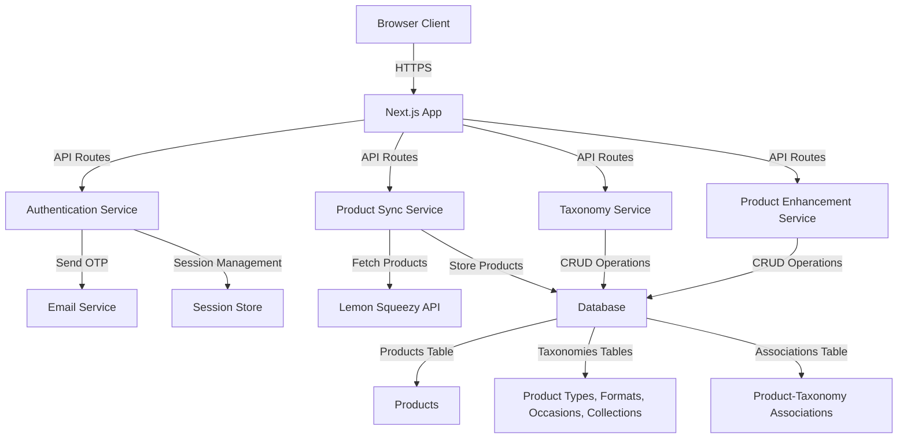

# Design Document: Lemon Squeezy Admin Dashboard

## Overview

The Lemon Squeezy Admin Dashboard is a Next.js web application that enables authenticated administrators to sync products from the Lemon Squeezy API and enhance them with custom taxonomy metadata. The system consists of three main subsystems: an authentication layer using email-based OTP verification, a product synchronization service that interfaces with the Lemon Squeezy API, and a product enhancement interface for managing taxonomies and product categorization.

The architecture follows a client-server model where the Next.js application serves both the frontend UI (built with shadcn components) and backend API routes. Data persistence is handled through a database that stores products, taxonomy entities, and their associations. The system prioritizes data integrity, user experience, and extensibility for future storefront integration.

## Architecture

### System Components



### Technology Stack

- **Frontend**: Next.js 14+ with App Router, React, TypeScript, shadcn UI, Tailwind CSS
- **Backend**: Next.js API Routes (serverless functions)
- **Database**: PostgreSQL (local development)
- **ORM**: Drizzle ORM for type-safe database access
- **Authentication**: Custom email-based OTP with session management
- **Email Service**: Resend for OTP delivery
- **API Client**: Fetch API for Lemon Squeezy integration
- **File Storage**: Cloudflare R2 for taxonomy images
- **Package Manager**: Bun

### Deployment Architecture

- **Hosting**: Vercel (Next.js optimized)
- **Database**: Local PostgreSQL (development), Neon PostgreSQL (production)
- **File Storage**: Cloudflare R2 for taxonomy images
- **Environment Variables**: Lemon Squeezy API key, Resend API key, database URL, session secret, R2 credentials

## Components and Interfaces

### 1. Authentication System

#### Components

**AuthenticationService**
- Validates email addresses against whitelist
- Generates and sends OTP codes
- Verifies OTP codes
- Creates and manages sessions

**SessionManager**
- Stores active sessions with expiration
- Validates session tokens
- Handles session cleanup

**AuthMiddleware**
- Protects admin routes
- Validates session on each request
- Redirects unauthenticated users

#### Interfaces

```typescript
interface AuthenticationService {
  sendOTP(email: string): Promise<{ success: boolean; error?: string }>;
  verifyOTP(email: string, otp: string): Promise<{ success: boolean; sessionToken?: string; error?: string }>;
  isEmailAllowed(email: string): boolean;
}

interface SessionManager {
  createSession(email: string): Promise<string>; // Returns session token
  validateSession(token: string): Promise<boolean>;
  invalidateSession(token: string): Promise<void>;
  cleanupExpiredSessions(): Promise<void>;
}

interface Session {
  token: string;
  email: string;
  createdAt: Date;
  expiresAt: Date;
}
```

#### API Routes

- `POST /api/auth/send-otp` - Send OTP to email
- `POST /api/auth/verify-otp` - Verify OTP and create session
- `POST /api/auth/logout` - Invalidate session
- `GET /api/auth/session` - Check session validity

### 2. Product Synchronization Service

#### Components

**LemonSqueezyClient**
- Authenticates with Lemon Squeezy API
- Fetches product data including images
- Handles API errors and rate limiting

**ProductSyncService**
- Orchestrates sync operations
- Checks for duplicate products
- Persists new products to database

**ProductRepository**
- Database operations for products
- Duplicate detection logic
- Product retrieval and updates

#### Interfaces

```typescript
interface LemonSqueezyClient {
  fetchAllProducts(): Promise<LemonSqueezyProduct[]>;
  fetchProductImages(productId: string): Promise<string[]>;
}

interface LemonSqueezyProduct {
  id: string;
  name: string;
  description: string;
  price: number;
  currency: string;
  images: string[];
  createdAt: string;
  updatedAt: string;
  // Additional Lemon Squeezy fields
}

interface ProductSyncService {
  syncProducts(): Promise<SyncResult>;
}

interface SyncResult {
  success: boolean;
  newProductsCount: number;
  skippedProductsCount: number;
  errors: string[];
}

interface ProductRepository {
  findByLemonSqueezyId(lsId: string): Promise<Product | null>;
  createProduct(product: LemonSqueezyProduct): Promise<Product>;
  getAllProducts(): Promise<Product[]>;
  updateProduct(id: string, data: Partial<Product>): Promise<Product>;
}
```

#### API Routes

- `POST /api/products/sync` - Trigger product sync from Lemon Squeezy
- `GET /api/products` - Get all products with enhancement status
- `GET /api/products/:id` - Get single product with full details

### 3. Taxonomy Management System

#### Components

**TaxonomyService**
- CRUD operations for all taxonomy types
- Handles image uploads for complex taxonomies
- Validates taxonomy data

**TaxonomyRepository**
- Database operations for taxonomies
- Retrieval by type
- Association management

#### Interfaces

```typescript
interface TaxonomyService {
  createSimpleTaxonomy(type: 'product_type' | 'format', title: string): Promise<SimpleTaxonomy>;
  createComplexTaxonomy(type: 'occasion' | 'collection', data: ComplexTaxonomyInput): Promise<ComplexTaxonomy>;
  getTaxonomiesByType(type: TaxonomyType): Promise<Taxonomy[]>;
  uploadTaxonomyImage(file: File): Promise<string>; // Returns image URL
}

interface SimpleTaxonomy {
  id: string;
  type: 'product_type' | 'format';
  title: string;
  createdAt: Date;
}

interface ComplexTaxonomy {
  id: string;
  type: 'occasion' | 'collection';
  title: string;
  description: string;
  imageUrl: string;
  createdAt: Date;
}

interface ComplexTaxonomyInput {
  title: string;
  description: string;
  image: File;
}

type Taxonomy = SimpleTaxonomy | ComplexTaxonomy;
type TaxonomyType = 'product_type' | 'format' | 'occasion' | 'collection';
```

#### API Routes

- `POST /api/taxonomies/product-types` - Create product type
- `POST /api/taxonomies/formats` - Create format
- `POST /api/taxonomies/occasions` - Create occasion (with image upload)
- `POST /api/taxonomies/collections` - Create collection (with image upload)
- `GET /api/taxonomies/:type` - Get all taxonomies of a specific type
- `POST /api/taxonomies/upload-image` - Upload taxonomy image

### 4. Product Enhancement System

#### Components

**ProductEnhancementService**
- Associates taxonomies with products
- Validates taxonomy selections
- Manages product enhancement status

**ProductTaxonomyRepository**
- Stores product-taxonomy associations
- Retrieves products with their taxonomies
- Updates associations atomically

#### Interfaces

```typescript
interface ProductEnhancementService {
  enhanceProduct(productId: string, enhancements: ProductEnhancements): Promise<EnhancedProduct>;
  getProductWithTaxonomies(productId: string): Promise<EnhancedProduct>;
}

interface ProductEnhancements {
  productTypeId?: string;
  formatIds?: string[];
  occasionId?: string;
  collectionId?: string;
}

interface EnhancedProduct extends Product {
  productType?: SimpleTaxonomy;
  formats: SimpleTaxonomy[];
  occasion?: ComplexTaxonomy;
  collection?: ComplexTaxonomy;
  isEnhanced: boolean; // True if any taxonomy is associated
}
```

#### API Routes

- `PUT /api/products/:id/enhance` - Update product taxonomies
- `GET /api/products/:id/enhanced` - Get product with all taxonomy data

### 5. UI Components

#### Page Components

**LoginPage** (`/admin/page.tsx`)
- Email input form
- OTP input form (conditional)
- Error and success messages
- Loading states

**DashboardPage** (`/admin/dashboard/page.tsx`)
- Product list with enhancement status
- Resync button with loading state
- Navigation to product edit

**ProductEditPage** (`/admin/products/[id]/page.tsx`)
- Product image carousel
- Taxonomy selectors with "+" buttons
- Save button
- Success/error feedback

#### Reusable Components

**TaxonomySelector**
```typescript
interface TaxonomySelectorProps {
  type: TaxonomyType;
  value: string | string[];
  onChange: (value: string | string[]) => void;
  multiple?: boolean;
  onAddNew: () => void;
}
```

**TaxonomyDialog**
```typescript
interface TaxonomyDialogProps {
  type: TaxonomyType;
  isOpen: boolean;
  onClose: () => void;
  onSave: (data: SimpleTaxonomyInput | ComplexTaxonomyInput) => Promise<void>;
}
```

**ProductCard**
```typescript
interface ProductCardProps {
  product: Product;
  isEnhanced: boolean;
  onClick: () => void;
}
```

**ImageCarousel**
```typescript
interface ImageCarouselProps {
  images: string[];
  alt: string;
}
```

## Data Models

### Database Schema

```typescript
// Using Drizzle ORM schema definition

import { pgTable, text, timestamp, real, boolean, uuid, index } from 'drizzle-orm/pg-core';

export const products = pgTable('products', {
  id: uuid('id').defaultRandom().primaryKey(),
  lemonSqueezyId: text('lemon_squeezy_id').unique().notNull(),
  name: text('name').notNull(),
  description: text('description'),
  price: real('price').notNull(),
  currency: text('currency').notNull(),
  images: text('images').array().notNull().default([]),
  createdAt: timestamp('created_at').defaultNow().notNull(),
  updatedAt: timestamp('updated_at').defaultNow().notNull(),
  
  // Taxonomy associations
  productTypeId: uuid('product_type_id').references(() => productTypes.id),
  occasionId: uuid('occasion_id').references(() => occasions.id),
  collectionId: uuid('collection_id').references(() => collections.id),
});

export const productTypes = pgTable('product_types', {
  id: uuid('id').defaultRandom().primaryKey(),
  title: text('title').unique().notNull(),
  createdAt: timestamp('created_at').defaultNow().notNull(),
});

export const formats = pgTable('formats', {
  id: uuid('id').defaultRandom().primaryKey(),
  title: text('title').unique().notNull(),
  createdAt: timestamp('created_at').defaultNow().notNull(),
});

// Many-to-many relationship for products and formats
export const productFormats = pgTable('product_formats', {
  productId: uuid('product_id').references(() => products.id).notNull(),
  formatId: uuid('format_id').references(() => formats.id).notNull(),
});

export const occasions = pgTable('occasions', {
  id: uuid('id').defaultRandom().primaryKey(),
  title: text('title').unique().notNull(),
  description: text('description').notNull(),
  imageUrl: text('image_url').notNull(),
  createdAt: timestamp('created_at').defaultNow().notNull(),
});

export const collections = pgTable('collections', {
  id: uuid('id').defaultRandom().primaryKey(),
  title: text('title').unique().notNull(),
  description: text('description').notNull(),
  imageUrl: text('image_url').notNull(),
  createdAt: timestamp('created_at').defaultNow().notNull(),
});

export const sessions = pgTable('sessions', {
  id: uuid('id').defaultRandom().primaryKey(),
  token: text('token').unique().notNull(),
  email: text('email').notNull(),
  createdAt: timestamp('created_at').defaultNow().notNull(),
  expiresAt: timestamp('expires_at').notNull(),
});

export const otps = pgTable('otps', {
  id: uuid('id').defaultRandom().primaryKey(),
  email: text('email').notNull(),
  code: text('code').notNull(),
  createdAt: timestamp('created_at').defaultNow().notNull(),
  expiresAt: timestamp('expires_at').notNull(),
  used: boolean('used').default(false).notNull(),
}, (table) => ({
  emailCodeIdx: index('email_code_idx').on(table.email, table.code),
}));
```

### Data Flow

1. **Product Sync Flow**
   - Admin triggers sync → API calls Lemon Squeezy → Fetch products → Check duplicates → Insert new products → Return sync result

2. **Product Enhancement Flow**
   - Admin selects product → Load product with taxonomies → Admin modifies selections → Save associations → Update enhancement status

3. **Taxonomy Creation Flow**
   - Admin clicks "+" → Dialog opens → Admin fills form → Upload image (if complex) → Save to database → Update selector options

4. **Authentication Flow**
   - User enters email → Generate OTP → Send email → User enters OTP → Verify OTP → Create session → Store session token in cookie → Grant access


## Correctness Properties

*A property is a characteristic or behavior that should hold true across all valid executions of a system—essentially, a formal statement about what the system should do. Properties serve as the bridge between human-readable specifications and machine-verifiable correctness guarantees.*

### Authentication Properties

**Property 1: Email Whitelist Enforcement**
*For any* email address that is not "digiinstastore@gmail.com", the Authentication_System should reject the login attempt and return an error message.
**Validates: Requirements 1.3**

**Property 2: Valid OTP Creates Session**
*For any* valid OTP code that has not expired, verifying the OTP should create a new Session with a valid session token.
**Validates: Requirements 1.5**

**Property 3: Invalid OTP Rejection**
*For any* OTP code that does not match the generated code for the email, the Authentication_System should reject the verification attempt.
**Validates: Requirements 1.6**

**Property 4: Session Persistence Across Navigation**
*For any* valid Session and any admin route navigation, the Session should remain valid and the user should stay authenticated.
**Validates: Requirements 1.8, 7.2**

**Property 5: Unauthenticated Access Redirect**
*For any* admin route accessed without a valid Session, the Authentication_System should redirect to the login page.
**Validates: Requirements 1.9**

**Property 6: Session Expiration Enforcement**
*For any* Session that has passed its expiration time, attempting to use that Session should result in denial of access and redirect to login.
**Validates: Requirements 7.3**

**Property 7: Logout Invalidates Session**
*For any* valid Session, calling logout should immediately invalidate the Session such that subsequent requests with that Session token are rejected.
**Validates: Requirements 7.5**

**Property 8: Session Creation Includes Expiration**
*For any* successful OTP verification, the created Session should have an expiration time set in the future.
**Validates: Requirements 7.1**

### Product Synchronization Properties

**Property 9: Complete Image Retrieval**
*For any* product fetched from the Lemon Squeezy API, all images associated with that product should be retrieved and stored.
**Validates: Requirements 2.3**

**Property 10: Duplicate Detection**
*For any* product fetched from the Lemon Squeezy API, the Product_Sync_Service should check if a product with the same Lemon Squeezy ID already exists in the database.
**Validates: Requirements 2.4**

**Property 11: New Product Insertion**
*For any* product fetched from the Lemon Squeezy API that does not exist in the database, the Product_Sync_Service should insert it as a new product.
**Validates: Requirements 2.5**

**Property 12: Sync Idempotence**
*For any* product that already exists in the database, syncing the same product again should not create a duplicate entry.
**Validates: Requirements 2.6**

**Property 13: Sync Error Handling**
*For any* sync operation that fails due to API errors or network issues, the Admin_Dashboard should display an error message.
**Validates: Requirements 2.8**

### Product Display Properties

**Property 14: All Products Displayed**
*For any* set of products in the database, the Admin_Dashboard should display all products in the product list.
**Validates: Requirements 3.1**

**Property 15: Complete Product Information Display**
*For any* product displayed in the list, the rendered output should include the product name, thumbnail image, and enhancement status indicator.
**Validates: Requirements 3.2, 3.3**

**Property 16: Product Navigation**
*For any* product in the product list, clicking on that product should navigate to the product edit interface for that specific product.
**Validates: Requirements 3.5**

### Product Enhancement Properties

**Property 17: All Images in Carousel**
*For any* product with multiple images, the enhancement interface should display all images in the carousel.
**Validates: Requirements 4.2**

**Property 18: Taxonomy Association**
*For any* taxonomy selection (Product Type, Format, Occasion, or Collection), selecting a taxonomy should associate it with the product being edited.
**Validates: Requirements 4.4, 4.5, 4.6, 4.7**

**Property 19: Enhancement Persistence**
*For any* set of taxonomy selections made for a product, clicking "Save" should persist all associations to the database atomically.
**Validates: Requirements 4.8, 10.6**

**Property 20: Save Failure Preserves State**
*For any* save operation that fails, the product data in the database should remain unchanged from its state before the save attempt.
**Validates: Requirements 4.10**

### Taxonomy Management Properties

**Property 21: Taxonomy Creation**
*For any* valid taxonomy data (title for simple taxonomies, or title + description + image for complex taxonomies), creating a new taxonomy should persist it to the database and return the created taxonomy with a unique ID.
**Validates: Requirements 5.3, 5.7, 6.3, 6.7**

**Property 22: Taxonomy Selector Update**
*For any* newly created taxonomy of any type, the taxonomy should immediately appear in the corresponding selector options without requiring a page refresh.
**Validates: Requirements 5.4, 5.8, 6.4, 6.8**

**Property 23: Cancel Prevents Creation**
*For any* taxonomy type, clicking "Cancel" in the creation dialog should close the dialog without creating a new taxonomy entry in the database.
**Validates: Requirements 5.9**

**Property 24: Complex Taxonomy Validation**
*For any* complex taxonomy (Occasion or Collection) submission with missing required fields (title, description, or image), the Admin_Dashboard should display validation errors and prevent submission.
**Validates: Requirements 6.9**

**Property 25: Image Upload Validation**
*For any* image uploaded for a complex taxonomy, the system should validate the image format and size, rejecting invalid images with an appropriate error message.
**Validates: Requirements 6.10**

### Error Handling and Feedback Properties

**Property 26: Loading Indicator Display**
*For any* asynchronous operation in progress, the Admin_Dashboard should display a loading indicator until the operation completes.
**Validates: Requirements 8.1**

**Property 27: Operation Feedback**
*For any* operation that completes (successfully or with failure), the Admin_Dashboard should display an appropriate message indicating the outcome.
**Validates: Requirements 8.2, 8.3**

**Property 28: Database Error State Preservation**
*For any* database operation that fails, the Admin_Dashboard should maintain the current UI state and display an error message without losing user input.
**Validates: Requirements 8.5**

**Property 29: Form Validation Feedback**
*For any* form with invalid data, the Admin_Dashboard should highlight invalid fields and display validation messages when submission is attempted.
**Validates: Requirements 8.6, 8.7**

### User Interface Properties

**Property 30: Form Field Labels**
*For any* form field in the Admin_Dashboard, there should be a clear, visible label associated with that field.
**Validates: Requirements 9.5**

**Property 31: Modal Dialog Behavior**
*For any* dialog displayed in the Admin_Dashboard, the dialog should be modal (preventing interaction with background content) until closed.
**Validates: Requirements 9.6**

**Property 32: Navigation Functionality**
*For any* navigation link in the Admin_Dashboard, clicking the link should navigate to the corresponding section or page.
**Validates: Requirements 9.8**

### Data Persistence Properties

**Property 33: Complete Data Persistence**
*For any* data entity (product, taxonomy, or association) created or updated, all fields of that entity should be persisted to the database.
**Validates: Requirements 10.1, 10.2, 10.3**

**Property 34: Transaction Atomicity**
*For any* database write operation that fails, no partial changes should be persisted to the database (all-or-nothing).
**Validates: Requirements 10.4**

**Property 35: Data Persistence Across Refresh**
*For any* data saved to the database, refreshing the page should load the same data without loss.
**Validates: Requirements 10.5**

## Error Handling

### Error Categories

1. **Authentication Errors**
   - Invalid email address
   - Invalid or expired OTP
   - Expired session
   - Missing session token

2. **API Errors**
   - Lemon Squeezy API unreachable
   - API rate limiting
   - Invalid API credentials
   - Malformed API responses

3. **Database Errors**
   - Connection failures
   - Query timeouts
   - Constraint violations (duplicate entries)
   - Transaction rollback failures

4. **Validation Errors**
   - Missing required fields
   - Invalid image format or size
   - Invalid data types
   - Business rule violations

5. **File Upload Errors**
   - File too large
   - Unsupported file format
   - Upload timeout
   - Storage quota exceeded

### Error Handling Strategy

**Client-Side Error Handling**
- Form validation before submission
- Display inline validation errors
- Show toast notifications for operation results
- Graceful degradation for network failures
- Retry mechanisms for transient failures

**Server-Side Error Handling**
- Try-catch blocks around all async operations
- Database transaction rollback on failures
- Structured error responses with error codes
- Logging of all errors for debugging
- Rate limiting to prevent abuse

**Error Response Format**
```typescript
interface ErrorResponse {
  success: false;
  error: {
    code: string;
    message: string;
    details?: Record<string, string[]>; // For validation errors
  };
}
```

**Error Recovery**
- Automatic retry for network failures (with exponential backoff)
- Session refresh on token expiration
- Optimistic UI updates with rollback on failure
- Clear user guidance for recoverable errors

## Testing Strategy

**Note**: Testing has been removed from this implementation to accelerate development. Focus is on building a working MVP with clean code and proper error handling. Testing can be added in a future iteration if needed.
